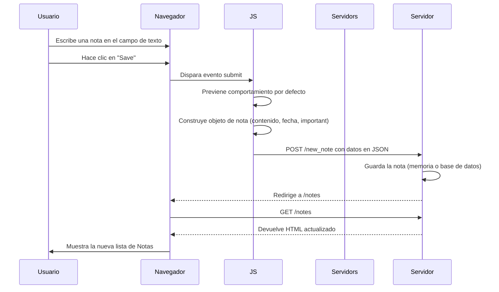

# part0


```
sequenceDiagram
participant Usuario
participant Navegador
participant Servidor

    Usuario->>Navegador: Accede a /spa
    Navegador->>Servidor: GET /spa
    Servidor-->>Navegador: HTML con referencia a main.js
    Navegador->>Servidor: GET /main.js
    Servidor-->>Navegador: Código JavaScript
    Navegador->>Servidor: GET /data.json
    Servidor-->>Navegador: JSON con las notas
    Navegador->>Usuario: Renderiza UI con las notas (JS manipula DOM)
```

sequenceDiagram
participant Usuario
participant Navegador
participant JS (main.js)
participant Servidor

    Usuario->>Navegador: Escribe texto en el campo
    Usuario->>Navegador: Hace clic en "Save"
    Navegador->>JS (main.js): Maneja evento click
    JS (main.js)->>JS (main.js): Crea objeto nota (texto + fecha)
    JS (main.js)->>Servidor: POST /new_note con JSON
    Servidor-->>JS (main.js): Respuesta OK
    JS (main.js)->>Navegador: Actualiza la vista con la nueva nota sin recargar
```
